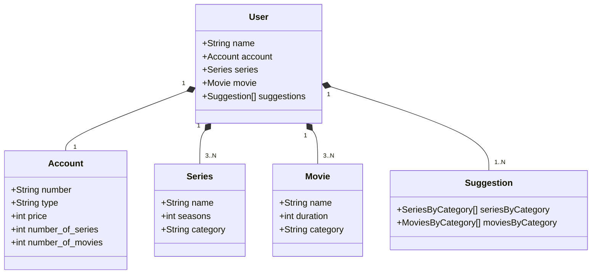

# Streaming service
RESTful Java API

## Class diagram

```mermaid
classDiagram
    class User {
        +String name
        +Account account
        +Series series
        +Movie movie
        +Suggestion[] suggestions
    }

    class Account {
        +String number
        +String type
        +int price
        +int number_of_series
        +int number_of_movies
    }

    class Series {
        +String name
        +int seasons
        +String category
    }

    class Movie {
        +String name
        +int duration
        +String category
    }

    class Suggestion {
        +SeriesByCategory[] seriesByCategory
        +MoviesByCategory[] moviesByCategory
    }

    User "1" *-- "1" Account
    User "1" *-- "3..N" Series
    User "1" *-- "3..N" Movie
    User "1" *-- "1..N" Suggestion
```
